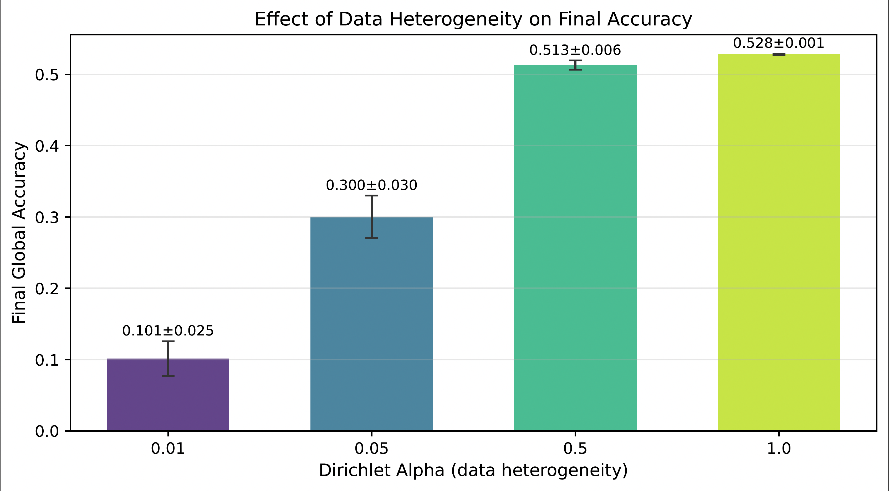
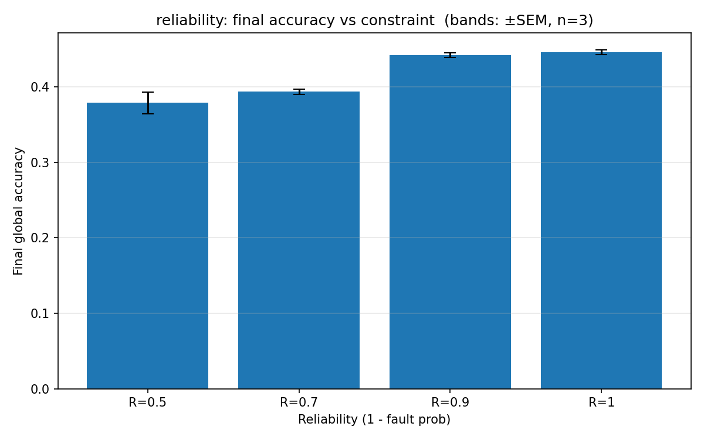
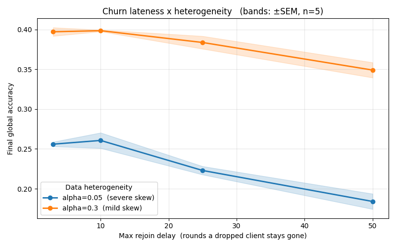
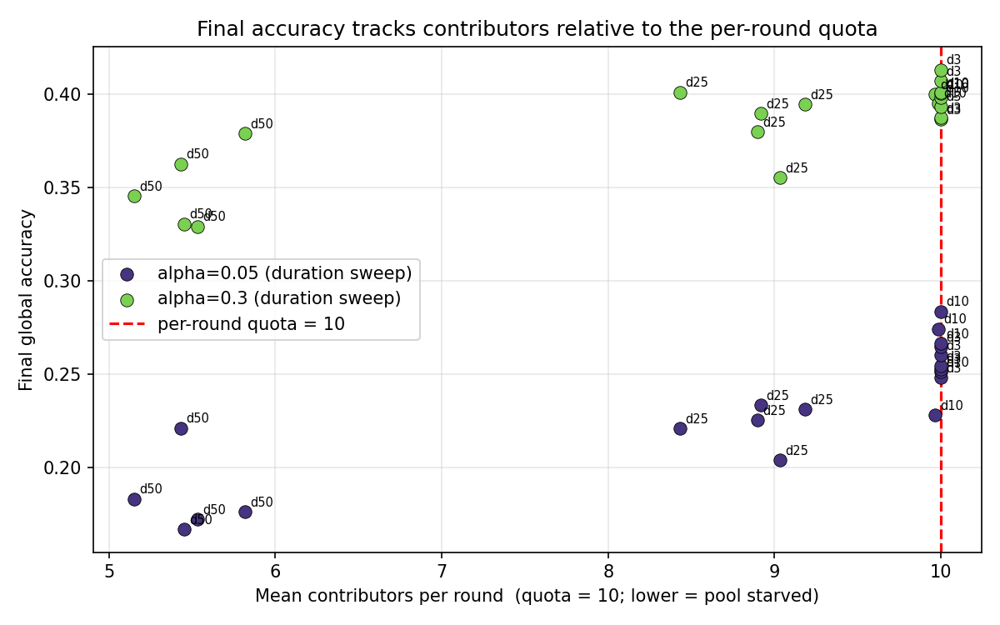
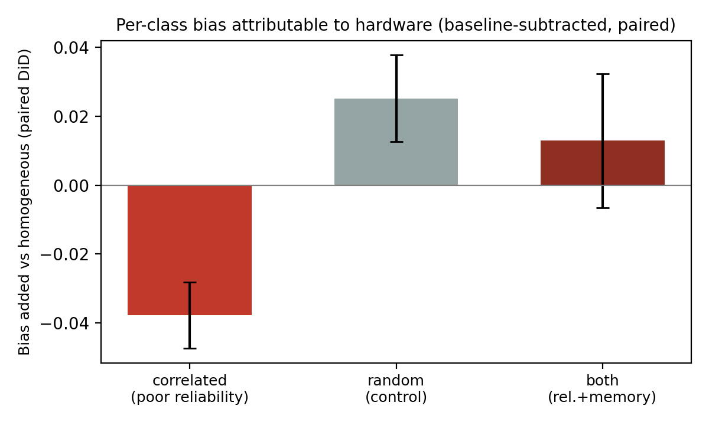
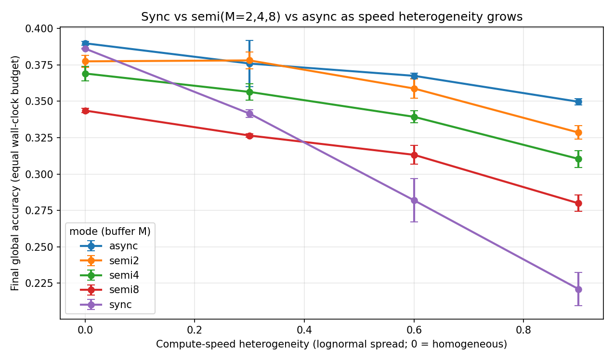
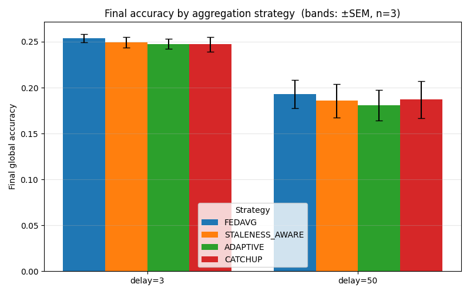

# FLSim

A controlled simulation of federated learning under heterogeneity, client churn and
system-design choices. Supporting code for *"How Heterogeneity, Churn and System Design
Affect Federated Learning: A Simulation Study."*

The simulator holds the model, dataset, optimizer and client-selection policy fixed
while varying one stressor at a time — data skew, churn, hardware constraints,
synchronization mode, aggregation strategy — so that observed degradation can be
attributed to a specific cause. All experiments use CIFAR-100, a compact ResNet-style
model and 50 clients with 10 selected per round unless a config overrides it.

The headline finding is that degradation is best explained by **information
availability**: severe skew narrows what updates contain, long absences thin the
contributor pool, and correlated poor hardware produces targeted per-class loss.
Reweighting received updates does not repair damage caused by updates that never
arrived.

## Install

```bash
git clone https://github.com/MinaBadri/FLSim.git
cd FLSim
python -m venv .venv && source .venv/bin/activate   # Windows: .venv\Scripts\activate
pip install -r requirements.txt
```

Python 3.11 and PyTorch 2.2. A CUDA GPU is strongly recommended — runs were done on
dual RTX 5000 Ada; CPU-only will work but is slow.

## Run

Experiments are driven by YAML configs:

```bash
python main.py --config configs/exp4_bias.yaml          # TODO: confirm entry point + flag
```

<!-- TODO: how are multiple seeds run? One of:
     python main.py --config configs/exp4_bias.yaml --seeds 5
     for s in 1 2 3 4 5; do python main.py --config ... --seed $s; done
     Replace this block with the real command. -->

Each run writes checkpoints that embed the fully resolved config that produced them,
so every reported setting is recoverable from the run artifacts rather than from the
YAML, which may have changed since.

### Experiments

| Config | Budget | Varies |
|---|---|---|
| `TODO` | 100r, E=10, n=3 | Dirichlet α ∈ {0.01, 0.05, 0.5, 1.0} |
| `TODO` | 80r, E=5, n=2–5 | speed, batch cap (+LR controls), reliability R |
| `TODO` | 80r/60r, E=10/5 | drop probability, max rejoin delay, α |
| `TODO` | 60r, E=5, n=3 | matched cohort control (5 clients/round) |
| `TODO` | 200r, E=5, n=3 | long-horizon churn |
| `exp4_bias.yaml` | 80r, E=5, n=5 | poor reliability: homogeneous / random / class-owners |
| `TODO` | equal virtual-time, n=2 | sync mode, buffer M ∈ {1, 2, 4, 8, 10} |
| `TODO` | 60r, E=5, n=3 | FedAvg vs. staleness-aware / adaptive / CatchUp |

### Analysis scripts

```bash
python audit_runs.py        # check runs against their embedded configs
python rebuild_summary.py   # regenerate summary tables from checkpoints
python mechanism_test.py    # rare-information (n_eff) diagnostic
```

## Results

Figure directories under `Results/Figures/` use an earlier six-RQ numbering that predates
the paper's reorganisation into three research questions. The mapping is given below.

**Data heterogeneity (RQ1)** — final accuracy by Dirichlet alpha. The loss is nonlinear and
concentrated in the severe-skew regime: about 19% retention at alpha=0.01 and 57% at
alpha=0.05, recovering to 97% by alpha=0.5.



**Client reliability (RQ1)** — unlike slow compute, failed clients remove updates from
aggregation entirely, so reliability directly reduces the information reaching the server.



**Churn lateness x heterogeneity (RQ2)** — accuracy is flat to a rejoin delay of 10 rounds,
then declines from 25. Severe skew loses a larger fraction of a lower baseline.



**Contributor pool (RQ2)** — final accuracy tracks how many clients actually contribute per
round, not how long absent clients stay away. Both skew levels follow the same relationship.



**Per-class bias attributable to hardware (RQ2)** — difference-in-differences against a
homogeneous baseline. Poor reliability placed on the *owners* of tracked classes produces
localized loss (-0.042 +/- 0.011, p = 0.02); the same amount placed randomly does not.



**Synchronization mode (RQ3)** — at an equal wall-clock budget, asynchronous execution
retains about 90% of its homogeneous-speed accuracy at spread 0.9 against about 57% for
synchronous, because the barrier leaves the pipeline idle.



**Aggregation under churn (RQ3)** — no reweighting strategy improves on FedAvg at either
rejoin delay. These methods only reweight updates that arrived.



## Citation

<!-- TODO: add once the paper has a venue and DOI. -->

## License

<!-- TODO: add a LICENSE file. MIT is the usual choice for research code. -->
